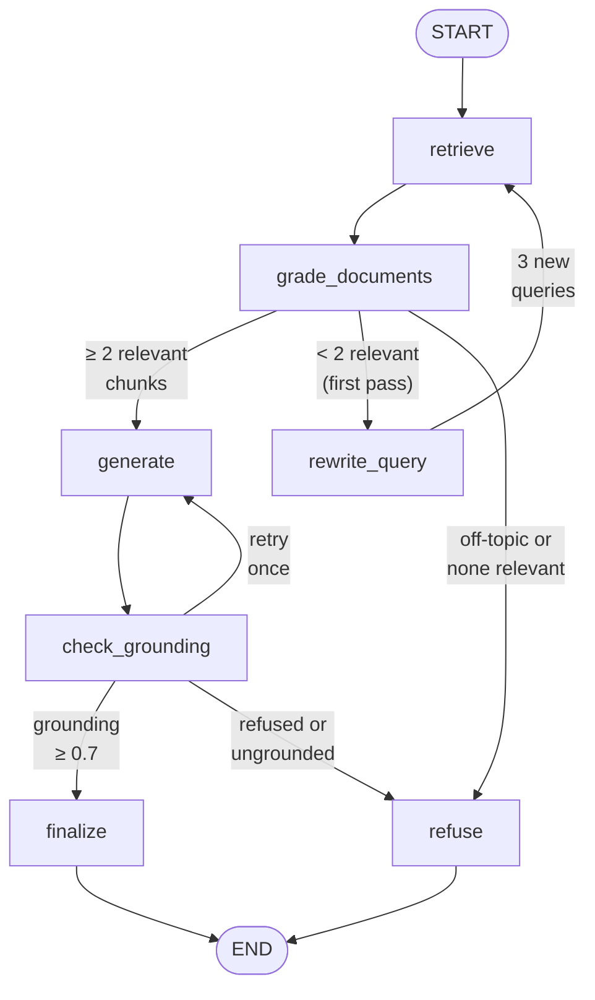

# Agentic AI eBook — RAG Chatbot (LangGraph + Pinecone)

A Retrieval-Augmented Generation chatbot that answers questions **strictly from the
[Agentic AI eBook](https://drive.google.com/file/d/15VLphKcY23_fpYxN62UEQRri_psRVfP9/view)**.
It retrieves relevant passages from Pinecone, generates a cited answer with GPT-4o-mini,
verifies the answer against the retrieved context, and returns a confidence score.
Questions outside the eBook's scope are refused.

**Highlights**
- Stateful **LangGraph** workflow with relevance grading, a **multi-query rewrite loop**, and a **hallucination (grounding) check**
- **Confidence score** from retrieval similarity + a **claim-level groundedness audit**: the grader
  enumerates each claim the answer makes and grades it against the context, and the score is computed
  in Python from those verdicts
- Page-number metadata on every chunk; answers cite pages, and tests verify every cited page was actually retrieved
- **FastAPI** endpoint and **Streamlit** UI, both returning `final_answer`, `retrieved_context_chunks`, and `confidence_score`
- Automated test script with 8 queries (6 in-scope, 2 out-of-scope) - **8/8 passing**
- **35 unit tests** covering the routing and scoring logic, run offline with no API keys and no cost

---

## Architecture

### 1. Ingestion pipeline (`src/ingestion.py`)

```
Ebook-Agentic-AI.pdf (60 pages)
  → pypdf text extraction, whitespace cleanup, skip near-empty pages (57 kept)
  → RecursiveCharacterTextSplitter (800 chars, 150 overlap) → 133 chunks
  → metadata per chunk: source, page, chunk_id
  → OpenAI text-embedding-3-small (1536-dim)
  → Pinecone serverless index (cosine), deterministic IDs (re-runs overwrite, no duplicates)
```

### 2. RAG graph (`src/graph.py`)



| Node | What it does |
|---|---|
| `retrieve` | Top-k (5) similarity search in Pinecone for each search query; merges and de-duplicates results, keeping chunks already judged relevant. |
| `grade_documents` | Drops chunks below a cosine-similarity floor (0.25), then an LLM grader (structured output) marks which remaining chunks actually help answer the question. |
| `rewrite_query` | If fewer than 2 relevant chunks were found, the LLM writes 3 alternative queries (keywords + synonyms, section-heading phrasing, implementation angle) and retrieval runs again. Runs at most once. |
| `generate` | Answers using **only** the relevant chunks, citing pages. Refuses with a fixed message if the context has nothing relevant. |
| `check_grounding` | The hallucination check. A second LLM call breaks the answer into its individual claims and grades each one `supported` / `partial` / `unsupported` against the context; the score is their weighted share, computed in Python. Low score → one retry with a stricter instruction. |
| `finalize` | Computes the confidence score. |
| `refuse` | Returns the refusal message with confidence 0.0. |

### 3. Confidence score

```
confidence = 0.4 × mean cosine similarity of the relevant chunks
           + 0.6 × grounding score
```

- **Retrieval similarity** measures how well the eBook covers the question.
- **Grounding score** measures whether the answer actually sticks to the retrieved text.
- Grounding gets the higher weight because it evaluates the answer itself.
- Refusals always return **0.0**.

The grounding score is **not** a number the LLM is asked for directly. Asking `gpt-4o-mini` to rate an
answer it had just written returned `1.0` on every single in-scope query - the 0.6-weighted term was a
constant, so confidence collapsed into a function of retrieval similarity alone. Instead the grader now
enumerates the answer's claims and labels each one, and Python computes the score:

```
grounding = (1.0 × supported + 0.5 × partial + 0.0 × unsupported) / total claims
```

A model that will not criticise its own answer as a whole *will* mark an individual claim unsupported.
No claims extracted scores `0.0` rather than `1.0`, so a grader that returns nothing fails closed into
one stricter retry and then a refusal.

### 4. Interfaces
- `app.py` — FastAPI `POST /chat` (graph built once at startup; sync endpoint so blocking LLM calls run in a worker thread)
- `streamlit_app.py` + `ui/`- chat-style research assistant (light pastel theme). Each answer shows a
  groundedness chip, its source passages (page + match score) and a live view of the LangGraph pipeline,
  streamed node-by-node from `GET /chat/stream`. The sidebar shows knowledge-base stats and live system
  status from `/kb/info` and `/health`. See `UI_SETUP.md` for the frontend architecture.
---

## Project structure

```
rag-agentic-ai/
├── data/
│   └── Ebook-Agentic-AI.pdf          # Source document
├── src/
│   ├── __init__.py
│   ├── config.py                     # Env vars, paths, model names, tuning constants
│   ├── ingestion.py                  # PDF → chunks → embeddings → Pinecone
│   └── graph.py                      # LangGraph workflow + run_query helper
├── ui/                               # Streamlit frontend
│   ├── __init__.py
│   ├── api_client.py                 # API service layer: live FastAPI client + mock client
│   ├── models.py                     # Typed response models (RAGResponse, Source, KBInfo, SystemStatus)
│   ├── pipeline.py                   # Maps LangGraph node events to UI pipeline steps
│   ├── html.py                       # Pure HTML builders for every component
│   ├── components.py                 # Streamlit components: header, welcome, chat turns, sidebar
│   └── theme.py                      # Design tokens and CSS (light pastel, Instrument Serif)
├── tests/
│   ├── test_units.py                 # Offline unit tests: routing, scoring, response shaping
│   └── test_grounding_live.py        # Opt-in: proves the grader can score a fabrication low
├── scripts/
│   ├── check_pdf.py                  # Verifies the PDF has extractable text (not scanned)
│   ├── find_in_pdf.py                # Lists pages mentioning given keywords
│   └── debug_retrieval.py            # Compares Pinecone results across query phrasings
├── results/
│   └── sample_query_results.json     # Full output of the test run
├── .streamlit/
│   └── config.toml                   # UI base theme
├── app.py                            # FastAPI application (/chat, /chat/stream, /health, /kb/info)
├── streamlit_app.py                  # Streamlit UI entry point (chat-thread layout)
├── tests_sample_queries.py           # 8 validation queries with automatic checks (end-to-end)
├── conftest.py                       # Puts the repo root on sys.path for pytest
├── UI_SETUP.md                       # Frontend architecture and run guide
├── requirements.txt                  # Loose ranges, for reading
├── requirements.lock.txt             # Exact pinned versions - install from this
├── .env.example
└── README.md
```
---

## Setup

**Requirements:** Python **3.10–3.13** (tested on 3.12; `langchain-pinecone` does not yet support 3.14),
an OpenAI API key, and a free Pinecone account.

```bash
git clone https://github.com/AGSGreeshma/rag-agentic-ai.git
cd rag-agentic-ai

python -m venv venv
# Windows (PowerShell):
venv\Scripts\Activate.ps1
# macOS / Linux:
source venv/bin/activate

pip install -r requirements.lock.txt
```

`requirements.lock.txt` holds the exact versions this project was built and tested against
(`langchain 1.4.3`, `langgraph 1.2.12`, `streamlit 1.64.0`, …). `requirements.txt` keeps the loose
ranges for readability, but install from the lock file - LangGraph's streaming internals in particular
are not a stable API, and the UI's live pipeline view depends on them.

Create a `.env` file from the template and add your keys:

```bash
cp .env.example .env        
```

```
OPENAI_API_KEY=your_openai_api_key
PINECONE_API_KEY=your_pinecone_api_key
PINECONE_INDEX_NAME=agentic-ai-index
```

The PDF is already included in `data/`. To re-download it:

```bash
gdown 15VLphKcY23_fpYxN62UEQRri_psRVfP9 -O data/Ebook-Agentic-AI.pdf
```

---

## Usage

### 1. Ingest the eBook into Pinecone (run once)

```bash
python -m src.ingestion            # creates the index if needed, then upserts chunks
python -m src.ingestion --reset    # deletes and recreates the index first
```

Expected output:
```
Loaded 60 pages, kept 57 with real text
Split into 133 chunks (avg 649 chars)
Creating index 'agentic-ai-index' (dim=1536, cosine)...
Embedding and upserting 133 chunks...
Done. Index 'agentic-ai-index' holds 133 vectors.
```

### 2. Ask a question from the command line

```bash
python -m src.graph "What is Agentic AI according to the eBook?"
```

### 3. Run the API

```bash
uvicorn app:app --reload
```

Interactive docs: http://127.0.0.1:8000/docs

| Endpoint | Purpose |
|---|---|
| `POST /chat` | Assignment response format plus page/similarity metadata |
| `GET /chat/stream?query=...` | Same pipeline streamed as Server-Sent Events: one event per LangGraph node, then the final result (used by the UI) |
| `GET /health` | Live checks: Pinecone reachable, OpenAI key valid (cached 30 s) |
| `GET /kb/info` | Knowledge-base metadata: pages, chunk count, index name, models |

```bash
curl -X POST http://127.0.0.1:8000/chat \
  -H "Content-Type: application/json" \
  -d '{"query": "What role does memory play in Agentic AI workflows?"}'
```

PowerShell:
```powershell
Invoke-RestMethod -Uri http://127.0.0.1:8000/chat -Method Post -ContentType "application/json" `
  -Body '{"query": "What role does memory play in Agentic AI workflows?"}' | ConvertTo-Json -Depth 5
```

Watch the pipeline run node by node:
```bash
curl -N "http://127.0.0.1:8000/chat/stream?query=What%20is%20Agentic%20AI%3F"
```

**Response format (`POST /chat`):**
```json
{
  "query": "What is Agentic AI according to the eBook?",
  "final_answer": "Agentic AI is defined as a type of artificial intelligence that creates impact by learning continuously, focusing on goals, and acting independently to anticipate needs... (p. 11).",
  "retrieved_context_chunks": ["1.2 How Agentic AI Stands Apart ...", "..."],
  "confidence_score": 0.88,
  "sources": [
    {"page": 7, "similarity": 0.7336, "used_in_answer": true},
    {"page": 11, "similarity": 0.7104, "used_in_answer": true}
  ],
  "rewritten_queries": [],
  "out_of_scope": false,
  "grounding_score": 1.0,
  "retrieval_score": 0.71
}
```

The first four fields are the required assignment format. The rest are extra fields for transparency:

| Field | Meaning |
|---|---|
| `sources` | Page number, cosine similarity and whether each retrieved chunk was used in the answer (same order as `retrieved_context_chunks`) |
| `rewritten_queries` | The alternative search queries, if the multi-query rewrite loop ran (otherwise empty) |
| `out_of_scope` | `true` when the question isn't covered by the eBook and the assistant refused |
| `grounding_score` | LLM hallucination check: how well the answer is supported by the chunks (0–1); `null` on refusals |
| `retrieval_score` | Mean similarity of the chunks used in the answer; `null` on refusals |

`confidence_score = 0.4 × retrieval_score + 0.6 × grounding_score`, and it is always `0.0` for refusals.

### 4. Run the Streamlit UI

The UI talks to the API, so start the backend first (terminal 1), then the UI (terminal 2):

```bash
uvicorn app:app --reload
streamlit run streamlit_app.py
```

To preview the UI without the backend: `RAG_API_MODE=mock streamlit run streamlit_app.py`

### 5. Run the tests

Unit tests first - these are offline, instant and free. They need no API keys and make no network
calls (the routing and scoring functions are pure functions of a state dict):

```bash
pytest tests/ -q                        # 35 tests, ~1.5 s
```

Then the end-to-end validation queries, which do call OpenAI and Pinecone:

```bash
python tests_sample_queries.py          # calls the graph directly
python tests_sample_queries.py --api    # calls the running FastAPI server
```

The live grounding regression test is opt-in, since it spends two OpenAI calls to confirm the grader
still marks a fabricated statistic down:

```bash
RUN_LIVE_TESTS=1 pytest tests/test_grounding_live.py -q          # bash
$env:RUN_LIVE_TESTS=1; pytest tests/test_grounding_live.py -q    # PowerShell
```

Each query is checked automatically:
- **In-scope:** not refused, confidence ≥ 0.5, answer has page citations, and **every cited page is in the retrieved context**
- **Out-of-scope:** refused, confidence exactly 0.0

Full outputs are saved to `results/sample_query_results.json`.

---

## Test results

Full outputs: [`results/sample_query_results.json`](results/sample_query_results.json). Run `python tests_sample_queries.py` to reproduce.

| # | Query | Expected | Result | Confidence | Time |
|---|---|---|---|---|---|
| 1 | What is the core definition of Agentic AI as outlined in the eBook? | Answer | ✅ Pass | 0.87 | 10.5 s |
| 2 | What are the main architectural components required to build agentic systems? | Answer | ✅ Pass | 0.85 | 7.2 s |
| 3 | What real-world industry use cases for Agentic AI are discussed in the eBook? | Answer | ✅ Pass | 0.87 | 4.8 s |
| 4 | How does Agentic AI differ from traditional generative AI chatbots according to the text? | Answer | ✅ Pass | 0.85 | 5.1 s |
| 5 | What key challenges or limitations of Agentic AI are mentioned in the document? | Answer | ✅ Pass | 0.84 | 10.6 s |
| 6 | What is the capital of France? | Refuse | ✅ Refused | 0.00 | 1.0 s |
| 7 | What role does memory play in Agentic AI workflows? | Answer | ✅ Pass | 0.69 | 4.0 s |
| 8 | Who won the 2022 FIFA World Cup? | Refuse | ✅ Refused | 0.00 | 0.6 s |

**8/8 passed.** Each in-scope answer was also checked automatically: not refused, confidence ≥ 0.5, page citations present,
and every cited page was actually among the retrieved chunks.

Out-of-scope questions reach at most ~0.07–0.10 cosine similarity against the eBook (vs. ~0.61–0.73 for in-scope questions),
so they are refused at the similarity floor in about a second, **without any LLM call**.

Confidence scores are stable between runs; response times vary with OpenAI API latency.

Query 7 is the one the claim-level grader marks down (grounding `0.75`, so confidence `0.69`): the eBook
supports the claim that memory enables learning from interactions, but the answer generalises past what
p. 20 actually states. Under the old single-float grader every in-scope query scored grounding `1.0` and
confidence landed in a 0.84–0.87 band; the spread is now 0.69–0.87.

---

## Design decisions & debugging notes

**1. Checking the data first.** Before building anything, `scripts/check_pdf.py` confirmed the PDF has
real extractable text (59 of 60 pages; page 1 is a cover image), so no OCR was needed. Pages under
100 characters (cover, title and divider pages) are skipped during ingestion.

**2. Wrong page citations.** An early answer cited "p. 3", which was not among the retrieved chunks — the
model had picked up a page number printed inside the eBook's own text. Fix: the prompt now requires
citing only the page numbers in the `[Passage N | page X]` headers. The test script checks that every
cited page was actually retrieved, so this can't regress.

**3. Broad questions missed the right section** The "challenges and limitations"
query initially failed: it was refused even though the eBook covers the topic. Investigation:
- `scripts/find_in_pdf.py` showed the content is on pp. 36 and 39–40 ("Challenges and Mitigation
  Strategies of Multi-Agent Systems", "Challenges of Orchestrating Complex Agentic Systems").
- `scripts/debug_retrieval.py` showed why it wasn't found: almost every chunk mentions "Agentic AI",
  so that phrase dominated the query embedding and only generic definition pages came back
  (all similarities in a flat 0.63–0.68 band). A keyword query without "Agentic AI" found pp. 36, 39, 40 immediately.
- Raising `TOP_K` did not help — the right pages weren't close to the top.

**Fix:** a conditional `rewrite_query` node. When fewer than 2 relevant chunks are found, the LLM writes
3 alternative queries that exclude "Agentic AI". Results from each query are merged (not re-ranked
against each other, since similarity scales differ between query styles), then graded again. The answer
now lists 9 cited challenges with confidence 0.85. Clearly off-topic questions skip the rewrite.

**4. The grounding score was saturated.** The first version of the hallucination check asked the LLM
for a single 0–1 float. It returned `1.0` on all six in-scope queries, which meant the 0.6-weighted
grounding term contributed no information at all and `confidence` reduced to `0.6 + 0.4 × retrieval` -
every answer landing in 0.84–0.87. The cause is structural: `gpt-4o-mini` was grading an answer
`gpt-4o-mini` had just written, against context selected *because* it supported that answer.

**Fix:** make the grader enumerate rather than rate. It now lists the answer's individual claims and
labels each `supported` / `partial` / `unsupported`, and Python computes the weighted share. The same
model that would not score its own answer below 1.0 will readily mark one claim of four unsupported.
`tests/test_grounding_live.py` guards this: an answer with a fabricated "43% cost saving" statistic must
score below the 0.7 threshold.

**5. Answer partial information instead of refusing.** The answer prompt originally refused unless the
context fully answered the question; it now answers with what the context contains and refuses only
when nothing relevant was found. The grounding check still guards against hallucination.

---

## Configuration (`src/config.py`)

| Setting | Value | Purpose |
|---|---|---|
| `CHUNK_SIZE` / `CHUNK_OVERLAP` | 800 / 150 | Chunk length and overlap in characters |
| `MIN_PAGE_CHARS` | 100 | Skip near-empty pages |
| `TOP_K` | 5 | Chunks retrieved per query |
| `MIN_SIMILARITY` | 0.25 | Similarity floor; below it a chunk is ignored |
| `MIN_RELEVANT_CHUNKS` | 2 | Fewer than this triggers the query rewrite |
| `MAX_QUERY_REWRITES` | 1 | At most one rewrite per question |
| `GROUNDING_THRESHOLD` | 0.7 | Minimum grounding score to accept an answer |
| `MAX_GENERATION_ATTEMPTS` | 2 | Generate once, retry once if ungrounded |
| `RETRIEVAL_WEIGHT` | 0.4 | Weight of retrieval similarity in the confidence score |

---

## Limitations & future improvements

- **PDF extraction artifacts:** pypdf sometimes merges words across line breaks ("practicalapplications").
  Retrieval still works, but a layout-aware parser (e.g. PyMuPDF) could improve chunk quality.
- **LLM-based grading** adds 1–2 extra LLM calls per question (~3–7 s total). A cross-encoder reranker
  could replace the relevance grader for lower latency. Claim-level grounding also makes the grading
  call's output longer than the answer it audits.
- **The grader still shares a model with the generator.** Claim enumeration broke the saturation, but
  `gpt-4o-mini` auditing `gpt-4o-mini` remains a weak check. A different model as grader, or a
  cross-encoder over each claim, would be a genuinely independent one.
- **Single-turn only:** no conversation memory; follow-up questions aren't resolved against earlier turns.
- **Confidence weights** (0.4 / 0.6) were chosen by reasoning rather than calibrated on a labelled
  dataset, and with only 6 in-scope queries the score is not calibrated against human judgement -
  it separates confident from shaky answers, but the absolute numbers carry no guarantee.
- **No auth or rate limiting** on `/chat`, which makes 3–4 LLM calls per request. Fine locally; it
  would need a throttle and a spend cap before being exposed publicly.
- **Future:** hybrid search (BM25 + vectors), streaming responses, evaluation with RAGAS, Docker deployment.

---

## Tech stack

Python 3.12 · LangGraph · LangChain · OpenAI (`gpt-4o-mini`, `text-embedding-3-small`) · Pinecone (serverless) · FastAPI · Streamlit · pypdf
